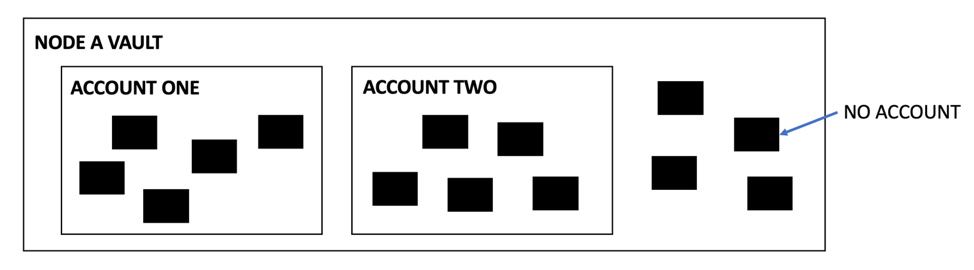
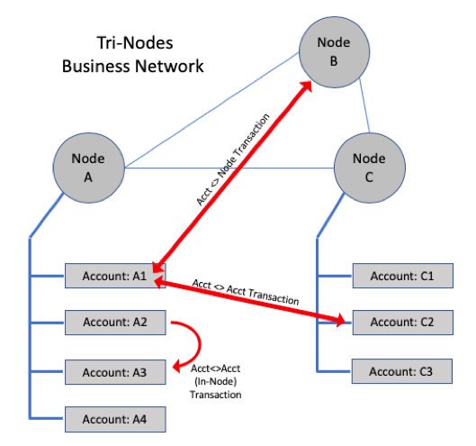

# Accounts documentation

## What are accounts?

The Accounts CorDapp allows a CorDapp developer to split a Corda node's vault up into logical sub-vaults. For further 
information please watch [this video](https://youtu.be/u_Hr79dvUHk?t=182).

Not all states stored in a node's vault need to be allocated to an account. Only those states which are held by 
`PublicKey`s assigned to an account ID are held by accounts.

## Accounts and the `AccountInfo` state

The base building block for the Accounts CorDapp is the `AccountInfo` state. It is a `ContractState`, so can be shared
with other nodes and contains basic information about an account:

* Account host (`Party`) which is used to map `PublicKey`s to a host node
* Account name (`String`) which is usually a human readable string to identity the account. It must be unique at the 
  account host level but may not be unique at the network level. The tuple of account host and account name is 
  guaranteed to be unique at the network level.
* Account ID (`UUID`) which is a 128-bit random ID that *should* be unique at the network level. The account ID is used 
  by Corda to map `PublicKey`s to accounts.   

For the time being, unlike regular Corda nodes which have a default key pair, the Accounts CorDapp intentionally doesn't 
create a new key pair and associate the `PublicKey` as the default key for a new account. Instead, when you wish to 
transact with an account the `RequestKey` flow should be used to request that an account on a local or remote node 
generate a new key pair and send back the `PublicKey` for use in a transaction.

`AccountInfo` states can be shared with other nodes using the `ShareAccountInfoFlow` and requested from other nodes 
using the `RequestAccountInfoFlow`. These flows will be covered in more detail later on in the documentation.

> There are also initiating versions of these flows which can be startable by a `CordaService` or via RPC. The naming 
> convention is such that in-line sub flows all have the word `Flow` as a suffix and the initiating versions of the 
> flows startable via RPC and service have the `Flow` suffix removed.

In this light, `AccountInfo`s act as a directory entry for accounts hosted on the local node as well as any other remote 
node. It is possible to enumerate all local accounts, or all accounts for a specific remote node, or indeed all accounts 
the node in question is aware of. By this point you are probably aware that there is a one-to-many relationship between 
node to account: a Corda node can host many accounts and this is depicted particularly well by the image below created 
by Peter Li from R3's developer relations team. 

The image shows that a node can host many accounts and that:

1. an account hosted by a node can transact with an account hosted by another node
2. two accounts hosted by the same node can transact with each other
3. an account hosted by a node can transact with a regular Corda node

### "But what IS an account?"

At this point it is important to remember than an account on a node is _just_ a collection of `PublicKey`s which have
been all assigned to the same `UUID`, which is the `linearId` of the `AccountInfo` state (described above). These 
`PublicKey`s can then be used to participate in (or own) `ContractState`s and that's how Corda determines which account 
a `ContractState` belongs to. When the transaction containing said `ContractState` is committed to the ledger, we can 
then say _that_ `ContractState` is owned or participated in by the account that the `PublicKey` is allocated to. When 
you wish to query the vault it is possible to specify from which account you wish to query states from.

That's all there is to accounts. To re-iterate and summarise:

1. `AccountInfo`s are used as an immutable record of the account ID, host and name at the network level
2. A host node can create new key pairs and allocate those key pairs to an account they host
3. A key pair allocated to an account can be used to participate in a `ContractState` - when that state is committed to
   the ledger with a transaction then we can say that that `ContractState` is owned/participated in by the account to
   which the `PublicKey` is allocated
4. The vault can be queried on a per account basis to return only the `ContractState`s for a specific account or set of
   accounts.   
   
For further information on how accounts work "under the hood" check out the appendix of this document where there is a 
video explaining how it all fits together.   

## Common questions

### What's the difference between an account and a node?

**Node**

A node is a process that runs `corda.jar`. Node's have a network identity issued to them by the trust root of the 
network the node participates in. The node has a vault to store state objects, a transaction store to store transactions
and a flow state machine manager to run flows. The node is essentially a container for running business logic written in
CorDapps. Corda nodes have:  

* a "default" `PublicKey` which is associated with the `CordaX500Name` for the node. Both the `PublicKey` and the 
  `CordaX500Name` are paired with each other inside the `Party` object for the node. 
* the capability to create new key pairs and allocate them to an "external ID" using the `IdentityService`. These keys 
  are often called "confidential identities" (`AnonymousParty`s) because they have no `CordaX500Name` associated to them 
  by default. 
* the capability, using the `IdentityService`, to allocate `PublicKey`s created by another node to the `CordaX500Name` 
  of that node and optionally an "external ID" associated with that node. 
* the capability to look-up the `CordaX500Name` (and therefore the `Party` object) for an `AnonymousParty` 
  (confidential identity) using the `IentityService`. 

**Account**

* An account is not a node. Instead, accounts are "hosted" on Corda nodes and an account represents a logical subset of 
  the host node's vault.
* An account doesn't have a unique identity associated with it. At the network level, the account's "identity" is the 
  `CordaX500Name` of the host node. However, accounts are _identifiable_ as an identity can be assigned to an account
  but this must be done at the application level.
* Unlike a Corda node, an account doesn't have a default `PublicKey` associated with it. To transact with an account, 
  you must request that the node hosting the account generate a new key pair for the account.

### Do I need to add account IDs to my state objects?

No! The motivation behind the design which uses `PublicKey`s mapped to account IDs is so that the notion of accounts is
not tightly coupled to state objects. The benefits are that you can use the same state objects for accounts and 
non-accounts enabled workflows. To find out which account the state belongs to, you can look-up the participation/owning 
keys to the account ID they are allocated to.

### How do we assign identities to accounts?

This is an application level concern and it's up to you how you solve it. 

### How do nodes become aware of accounts?

Again, this is an application level concern. This version of account doesn't ship with any sort of automatic discovery 
mechanism. However, there are primitive flows `RequestAccountInfo`/`ShareAccountInfo` for sharing `AccountInfo`s as well
as `ShareStateAndSyncAccounts` for sharing a state with another node, along with all the `AccountInfo`s and `PublicKey`
mapping for the accounts involved in that state.

If you are writing an "accounts enabled" CorDapp you'll probably want to write a flow that shares new accounts with all
the other nodes in your business network that need to be aware of the new accounts.

### How do we mix workflows with accounts and non-accounts?

For now, in the interests of simplicity, we would suggest that if you need to use accounts then use accounts on all 
nodes on your business network. For a node that doesn't _need_ to use accounts then you can just set up a "default" 
account for that node.

*Writing your CorDapp if you want to have some nodes not using accounts*

This is a bit tricky for now. You'll need to update your flows with logic to determine if a state participant/owner is
an account holder, or not. This can be done using the `AccountService` APIs. If so, then some additional steps should be
taken to share the required `AccountInfo`s and `PublicKey` mappings with other nodes that need to see them. 

Working with accounts is much like working with confidential identities but with the addition of the `AccountInfo` 
state. For example, when using confidential identities, a new `PublicKey` would be requested from a counterparty node 
before creating a transaction with that counterparty. The same workflow is required with accounts - a new `PublicKey` 
should be requested before creating a state and transaction. The biggest difference is that, in your flow, you must also
specify from which account the new `PublicKey` should be allocated to. However, of course, this should be known up-front
by the node invoking the flow.

*State selection when using accounts and unaccounted states on the same node*

Currently, if accounts and non-accounts workflows are mixed on the same node then you need to be careful with state 
selection. When selecting states for non-accounts workflows, the state selection code will currently pick states which
could be assigned to accounts. However, when selecting states for accounts workflows, you will supply the account ID for
the account you want to select states from, discriminating the states query to only states held by the specified 
account. The best solution for now is to mandate that a node uses accounts for _all_ states or not at all.

## Are states for different accounts segregated?

No. They are all stored in the same `VaultService` operated by the host node. States held by different accounts on the 
same node can be partitioned by their account ID when querying the vault. See below for more info.

## How do we handle permissions on a per account basis?

This must be done at the application level for now and can be handled in the RPC client part of your CorDapp.
   
## Typical workflows

### Creating new accounts

A new account can be created by either calling the `CreateAccount` flow via RPC or from an existing flow, 
or by calling `AccountService.createAccount`. The `CreateAccount` method simply calls the `CreateAccount` flow and 
returns a `CordaFuture` which completes when the `CreateAccount` flow successfully terminates.

To create an account, you must specify an account name. the account ID is chosen randomly by the Accounts CorDapp. When
the `CreateAccount` flow terminates, it returns a `StateAndRef<AccountInfo>` for the account which has just been 
created. 

The `CreateAccount` flow does not communicate with any nodes as it performs an internal process only (a notary signature
is not required for state creation when the creating transaction does not include a `TimeWindow`).

Code sample:

    // Create account by invoking flow via RPC.
    val accountInfo: StateAndRef<AccountInfo> = rpcProxy.startFlow(::CreateAccount, "Roger's account").returnValue.getOrThrow()
    
    // Create account by using sub flow (from inside a flow).
    val accountInfo: StateAndRef<AccountInfo> = subFlow(CreateAccount("Roger's account"))
    
    // The AccountService provides access to triggering Account related flows from within a Corda Service.
    val accountInfo: StateAndRef<AccountInfo> = accountService.createAccount("Roger's account").getOrThrow()
    
### Looking up an account by account ID or account name    
    
Once you have created a new account, you can use the `AccountService` to obtain the `AccountInfo` by name or by account 
ID using the following methods on `AccountService`:

    fun accountInfo(id: UUID): StateAndRef<AccountInfo>?
    fun accountInfo(name: String): List<StateAndRef<AccountInfo>>?
    
These methods will either return the `AccountInfo` linked to the specified account ID or name or return `null` if an
account cannot be found with the specified account ID or name.     

Code sample:

    // Create account from inside a flow.
    val accountInfo = subFlow(CreateAccount("Roger's account"))
    // Then look up the account by account ID and name.
    accountService.accountInfo(accountInfo.state.data.name)
    accountService.accountInfo(accountInfo.state.data.identifier.id)
    
Accounts can also be looked up by name and account ID via RPC using the following flows: `AccountInfoByName` and 
`AccountInfoByUUID`. These flows are required because `CordaService`s are not accessible directly via RPC.    
    
### Creating new keys for accounts and assigning state ownership to accounts

`AccountInfo`s are not much use by themselves. The idea behind the accounts CorDapp is that `PublicKey`s can be created
and assigned to an account, then used to participate in states for the account they are assigned to. 

New keys can be requested for an account by using the pair of flows called `RequestKeyForAccountFlow` and 
`SendKeyForAccountFlow`. These flows can be used to request a new key for an account which was created on a remote node
as well as requesting a new key for an account on the _same_ node. The flows deal with both possibilities. 

A new request using `RequestKeyForAccountFlow` can be made by passing in the `AccountInfo` for the account you want to
request a new `PublicKey` for. This means you need the `AccountInfo` for the account you want a new key for _before_ you
request the new `PublicKey`. The responder flow `SendKeyForAccountFlow` will be invoked as the counter-flow. A number of
possibilities can happen:

1. The node running the counter-flow is the same as the requesting node, in which case, the account originated on the 
   requesting node. Therefore no messages need to be sent to a remote node. The key can be created locally and mapped to
   the host node and account ID specified in the `AccountInfo`.
2. The node running the counter-flow is a remote node but it is not aware of the provided `AccountInfo`. In which case,
   the remote node will respond that it is not aware of the account and the requesting flow will return an exception.
3. The node running the counter-flow is aware of the provided `AccountInfo`, so generates a new key pair and allocates
   the new `PublicKey` to itself as the host node and the account ID of the provided `AccountInfo`. The new `PublicKey` 
   is then sent back to the requesting node with a proof that it was generated by the node running the counter-flow. At
   this point, the requesting node, verifies the proof and stores a mapping of the new `PublicKey` to the host node and
   account ID.
   
Once the `RequestKeyForAccountFlow` terminates, it is safe to say that you have a new key mapped to the account ID and
account host for the specified `AccountInfo` and the account host has an equivalent mapping. It is also safe to say that
both the requester and the host node both have a copy of the `AccountInfo`. If the requester node is the same as the 
host node, of course, the prior statements hold true.
   
For more information on the key request protocol, take a look at the 
[`confidential-identities`](https://github.com/corda/confidential-identities/) CorDapp which is a dependency of the 
Accounts CorDapp.    

There are startable by RPC and initiating versions of the aforementioned flows, called `RequestKeyForAccount` and 
`SendKeyForAccount`.   

Code sample for requesting a new key from an account on the same node or remote node:    
    
    // Requestor flow.
    // Assumption is that we already have the AccountInfo.
    val accountInfo: StateAndRef<AccountInfo> = accountService.accountInfo("Some account name")
    val newKey: AnonymousParty = subFlow(RequestKeyForAccountFlow(
            accountInfo = accountInfo,
            hostSession = initiateFlow(accountInfo.state.data.host) 
    ))

    // Responder flow.
    subFlow(SendKeyForAccountFlow(otherSideSession))
    
### Looking up an account by `PublicKey`

The `AccountService` provides an API to look-up which account a particular `PublicKey` belongs to. The caveat is that
the `PublicKey` must have been obtained using `RequestKeyForAccountFlow` and `SendKeyForAccountFlow`, or manually mapped
to the account host and account ID. This API must also perform a look-up of the `AccountInfo` and so will only return a 
value if the associated `AccountInfo` for that `PublicKey` has also been stored. To look up the account ID for a 
`PublicKey` use:

    fun accountIdForKey(owningKey: PublicKey): UUID?
    
To look up the `AccountInfo` for a `PublicKey` use:

    fun accountInfo(owningKey: PublicKey): StateAndRef<AccountInfo>?
    
Code sample: 

    // Requestor flow.
    // Assumption is that we already have the AccountInfo.
    val accountInfo: StateAndRef<AccountInfo> = accountService.accountInfo("Some account name")
    val newKey: AnonymousParty = subFlow(RequestKeyForAccountFlow(
            accountInfo = accountInfo,
            hostSession = initiateFlow(accountInfo.state.data.host) 
    ))     
    val sameAccountInfo: StateAndRef<AccountInfo> = accountService.accountInfo(newKey)

There is a startable by RPC version of this method called `AccountInfoByKey`.

### Looking up a host by `PublicKey`/`AnonymousParty`

You can look-up `AbstractParty`s to the host `Party` using an API on the `IdentityService`:

    fun wellKnownPartyFromAnonymous(party: AbstractParty): Party?
    
This API doesn't require that the `AccountInfo` associated with the `AnonymousParty`/`PublicKey` has also been stored. 

### Obtaining a list of accounts

There are three APIs on the `AccountService` for obtaining a list of accounts:

1. `ourAccounts` which returns all the accounts created on the node in question.
2. `accountsForHost` which returns all the accounts created by a specific host. Clearly, only `AccountInfo`s which have
   been shared with the node will be returned.
3. `allAccounts` which returns all `AccountInfo`s regardless of which node is the host.   
   
There are accompanying startable by RPC flows so these functions can be invoked via RPC.    

### Obtaining all the `PublicKey`s for an account

There is an API on `AccountService` for obtaining all the `PublicKey`s mapped to an account ID. This is useful if you 
would like to re-use `PublicKey`s instead of requesting a new `PublicKey` from an account for each new transaction with
that account. In this version of accounts there's no in-built functionality for re-using `PublicKey`s. However, you can
quite easily create your own flow for doing this, if it is required. To enumerate all `PublicKey`s for an account, use
this API on `AccountService`:

    fun accountKeys(id: UUID): List<PublicKey>
    
If either the account ID is unknown or there are no `PublicKey`s mapped to the account ID, then the method call will
return an empty list. Otherwise, all the keys mapped to that account will be returned. Note that this method works for
accounts created on remote nodes providing the `AccountInfo` and `PublicKey` mappings have previously been shared with 
the calling node.

Example code:    

    // Showing initiator flow only and assuming we already have an AccountInfo from a remote node.
    val accountHost: Party = someAccountInfo.host
    val newKeyOne: AnonymousParty = subFlow(RequestKeyForAccountFlow(accountInfo, initiateFlow(accountHost)))   
    val newKeyTwo: AnonymousParty = subFlow(RequestKeyForAccountFlow(accountInfo, initiateFlow(accountHost)))  
    // Should return a list _at least_ containing the above two keys.    
    val keys: List<PublicKey> = accountService.accountKeys(someAccountInfo.identifier.id)

### Requesting and sharing the `AccountInfo` from/to another node by using the account ID/`AccountInfo`

This can be done using the `RequestAccountInfoFlow` and `ShareAccountInfoFlow` which are both in-line flows. There are 
also initiating versions of these flows which are startable via RPC.

The `RequestAccountInfoFlow` takes an account ID and a `FlowSession` for the host of the account with the specified 
account ID and returns the `AccountInfo` for the account. If the host is not aware of an account with the specified
account ID, then the flow returns `null`.

The `ShareAccountInfoFlow` is the opposite of the above flow. A node which already has an `AccountInfo` can share it 
with another node. The flow takes the `StateAndRef<AccountInfo>` to share and a `FlowSession` for the node to share it
with.

It is important to make sure that all nodes which need `AccountInfo`s have them before you start transacting between
accounts, otherwise nodes in your business network will not be able to map account IDs and account hosts to `PublicKey`s 
for that accounts they are not aware of.

### Querying the vault by account

It is very important that we can query the vault by account. As such, there is a new property added to 
`VaultQueryCriteria` in Corda 4.3 and it can be used like so via RPC:

    rpcProxy.vaultQueryByCriteria(
            QueryCriteria.VaultQueryCriteria(externalIds = listOf(accountId)),
            StateClass::class.java
    )
    
and inside a flow:

    serviceHub.vaultService.queryBy(
            QueryCriteria.VaultQueryCriteria(externalIds = listOf(accountId)),
            StateClass::class.java
    ) 
    
Using this approach, the vault query will only return states which have participation/owning keys which are allocated
to the specified account ID. If the account ID is unknown to the node or no states are in the vault which are linked
to the specified account ID, then the query will return an empty list.    

## Appendix

### Examples

The best way to learn is by looking at existing code. In that light check-out these example CorDapps which use the
Accounts CorDapp:

* [SupplyChain](https://github.com/peterli-r3/Accounts_SupplyChain) (By Peter Li, R3) 
* [Sweepstake]() (By Will Hester, R3)
* [GoldTrading]() (By Stefano Franz, R3)

### Why use accounts?

Please see [this video](https://www.youtube.com/watch?v=u_Hr79dvUHk) where Roger explains why we created accounts and 
the benefits of using accounts.

### How does accounts work under the hood?

Please see [this video](https://www.youtube.com/watch?v=nHljbpe3NDY) where Roger explains how accounts work "under the 
hood".
